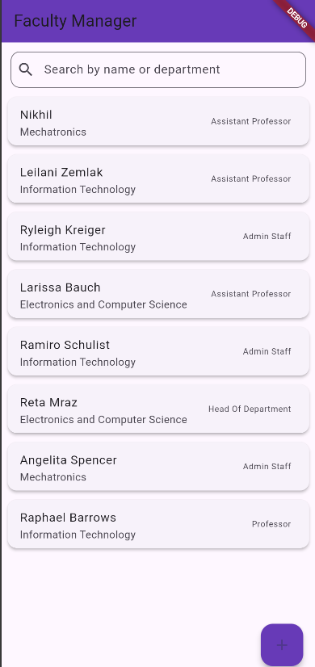
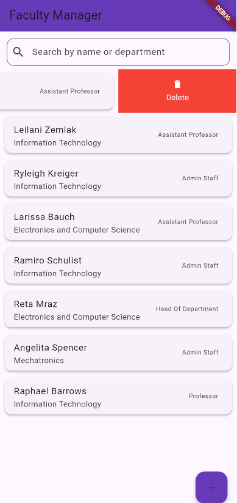
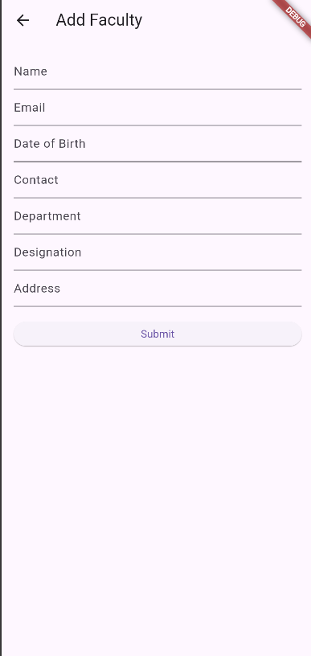

# 🎓 Faculty Management App (Flutter Internship Project - Getfly Technologies)

This is a Flutter-based Android app that performs **CRUD operations** on a mock faculty database using **Mockoon** as the backend API. It satisfies all requirements outlined in the Getfly Technologies internship assignment.

---

## 📁 Project Structure

lib/
┣ models/
┃ ┗ faculty_model.dart # Faculty data model
┣ services/
┃ ┗ api_service.dart # Handles API requests (GET, POST)
┣ screens/
┃ ┣ home_screen.dart # Lists all faculty entries
┃ ┣ add_faculty_screen.dart # Add new faculty via form
┃ ┗ edit_faculty_screen.dart
┣ main.dart # App entry point


---

## 🔧 State Management Approach

- Used **`setState()`** for updating the UI after Create/Delete operations.
- New faculty are added to a local list in memory and displayed without relying on persistent backend updates (due to mock API limitations).
- The list updates immediately after submission via `Navigator.pop(context, newFaculty)` and `setState()`.

---

## 📚 Libraries Used

| Package              | Description                                   |
|---------------------|------------------------------------------------|
| `http`              | To send GET/POST requests to the mock API      |
| `intl`              | For date formatting                            |
| `flutter_slidable`  | (Optional) For swipe actions (Edit/Delete)     |
| `provider`          | (Optional) If enhanced state management needed |
| `shared_preferences`| (Optional) For caching or local storage        |

---

## 🚀 Features

- View list of faculty
- Add new faculty using a form
- In-memory update of the UI after new entries
- Mock API integration using **Mockoon**

---

## 🧪 Mock API Setup

We use **Mockoon CLI** to simulate backend behavior.

### 🔧 Step-by-Step

1. Install Mockoon CLI:
   ```bash
   npm install -g @mockoon/cli

2. Place trial.json at the root of your project:
faculty_manager/
├─ lib/
├─ android/
├─ trial.json   👈 Place it here
└─ ...

3. Start the mock server:(if not there)
mockoon-cli start --data "./trial.json" --port 3001

4.The API base URL used in code:
http://localhost:3001/faculty

5.Screenshots
## 📸 Screenshots











Developed With
Flutter 3.32.1

Dart 3.8.1

Mockoon CLI

Visual Studio Code / Android Studio
